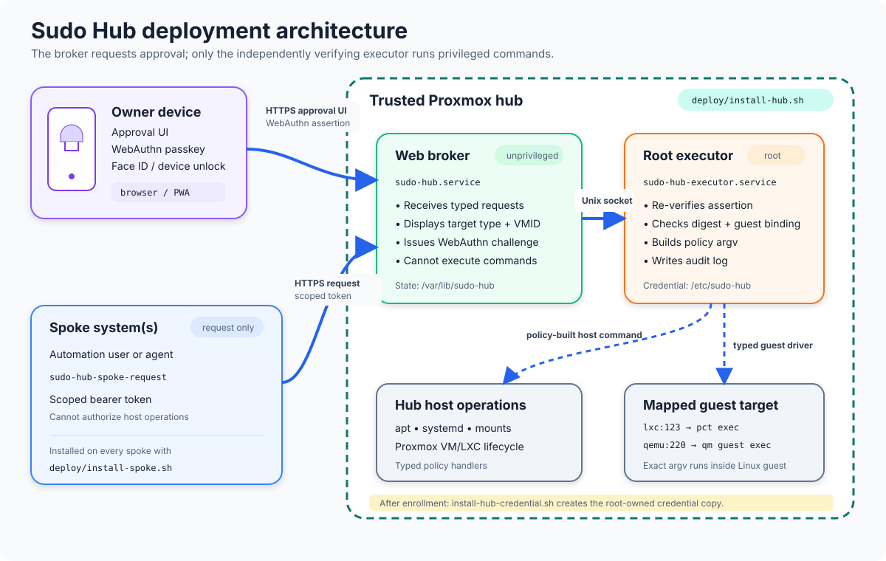

# Deployment

The hub runs the unprivileged web broker and root executor on the trusted
Proxmox host. A spoke only installs the request client and a scoped bearer
token; privileged guest commands still execute through the hub's root
executor. LXC targets use `pct exec`; Linux QEMU/KVM targets use
`qm guest exec` through the QEMU Guest Agent.



## Hub

1. Copy `hub.env.example` to the ignored `hub.env` and set the public origin,
   RP ID, spoke token mapping, and typed Proxmox guest mapping. For example,
   use `SPOKE_TARGET_SPEC=spoke=lxc:123` or
   `SPOKE_TARGET_SPEC=spoke=qemu:220`.
2. Run `sudo ./deploy/install-hub.sh`. The installer creates the `sudo-hub`
   system user, installs the application and dependencies into
   `/opt/sudo-hub/.venv`, installs both systemd units, and starts the broker.
3. Open the approval UI and enroll the owner's passkey.
4. Run `sudo sudo-hub-install-credential`. This makes a root-owned copy of the
   enrolled credential and starts the executor.

The broker creates the scoped token at the path configured by
`SPOKE_TOKEN_SPEC`. Transfer that token to the spoke over a secure channel.

For a QEMU target, install and start `qemu-guest-agent` inside the Linux VM,
then enable the Guest Agent option for that VM in Proxmox. For example:

```console
# Inside a Debian or Ubuntu guest
sudo apt-get install qemu-guest-agent
sudo systemctl enable --now qemu-guest-agent

# On the Proxmox host
sudo qm set 220 --agent enabled=1
```

Restart the VM after first enabling the agent. Sudo Hub currently applies its
Linux absolute-path command policy to both guest types; Windows guest command
execution is not supported. A QEMU Guest Agent timeout stops waiting but cannot
terminate the process inside the guest, so keep approved commands independently
bounded and safe to observe after a timeout.

## Spoke

1. Copy `spoke.env.example` to the ignored `spoke.env`. Set the hub URL and the
   local user that will submit requests.
2. Place the transferred token at `deploy/client-token-spoke` or pass its path
   as the second installer argument.
3. Run `sudo ./deploy/install-spoke.sh [config-path] [token-path]`.
4. Start a new login session so the configured user receives its
   `sudo-hub-spoke` supplementary group, then use `sudo-hub-spoke-request`.

Exact guest commands use the `guest.admin.command` operation. The older
`container.admin.command` and `container.command.lease` names remain accepted
for existing LXC clients.

Both installers are idempotent and can be rerun to upgrade an existing source
checkout. Review the unit sandboxing and operation policy before production use.
